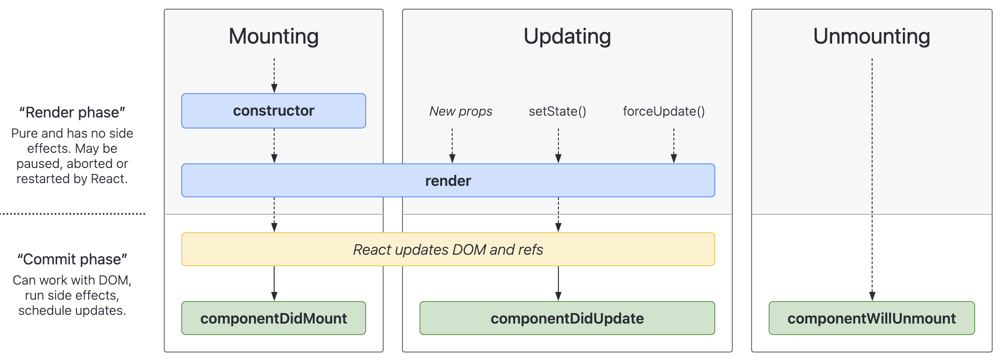

## BEAR U
<hr />

<br />
<br />

### defaultProps
- props(프롭스) 기본값을 정의.
```javascript
// App.js
function App() {
  return <Hello />
}

// Hello.js
// 받아오는 porps.name이 없을 때 에러 발생
function Hello({name}) {
  return <h1>Hello, {name}</h1>
}

// 이럴 때, 기본 props 값을 정의해주는 것이 defaultProps
Hello.defaultProps = {
  name: 'React!'
}

export default Hello;
```
<br />

### 'children'으로 하위 컴포넌트 불러오기
- 감싸는 컴포넌트(ex. Wrapper)가 `{children}`을 넣어줘야 하위요소를 감싸준다.
```javascript
// Wrapper.js
function Wrapper({children}) {
  return <div></div>
}

// Hello.js
function Hello({name}) {
  return <h1>Hello, {name}</h1>
}

// App.js
function App() {
  return (
    <Wrapper>
      <Hello name="HaHa" />
      <Hello name="HaHa" />
    </Wrapper>
  )
}
```
<br />

### state 활용
```javascript
// Input.js
function Input () {
  const [inputs, setInputs] = useState({
    subject: "",
    score: "",
  })

  // input에 입력한 값으로 체인지 함수
  const onChange = (e) => {
    const { value, name } = e.target;
    setInputs({
      // 객체 값을 변경할 땐, 항시 복사를 먼저 한 후에 수정해야 한다.
      ...inputs,
      // name만 써주게되면 string으로 인식이 되기 때문에 []로 표시 한다.
      [name] : value
    })
  }

  return (<div>
    <h2>성적: {inputs.subject} {inputs.score}</h2>
    <input type="text" name="subject" placeholder="수학" value={inputs.subject} onChange={onChange} />
    <input type="text" name="score" placeholder="99" value={inputs.score} onChange={onChange} />
  </div>)
}
```
<br />

### Hook
#### 라이프사이클 (lifecycle, 컴포넌트의 생명주기)
;
- 리액트 라이프 사이클 다이어그램 : [자세히보기](https://projects.wojtekmaj.pl/react-lifecycle-methods-diagram/)
<br />

- Mounting > Updating > Unmounting 순으로 진행이 된다.
- 페이지 안에서는 위에서 아래 방향으로 진행이 된다.
- **constructor** : 컴포넌트가 생겨나는 과정을 의미한다. (== 함수를 정의할 때 생겨난다)
- **render (렌더링)** : DOM에 등록을 하기 전에 렌더링 과정을 거친다. 브라우저에 DOM에 어떤 객체가 들어가서 브라우저 화면에 나타나도록 하는 것.
- 렌더링이 진행이 되면서 Updating 페이지가 함께 진행이 된다. 
- **Updating** : 업데이팅 페이지에서 하는 일은 함수에서 갖고 있는 props, state 값을 이용해서 리턴하고 있는 jsx 컴포넌트의 값을 업데이트 해준다.
- 하나의 컴포넌트 등록과 값이 업데이트 되는 렌더링을 모두 거친다.
- 리액트에서는 브라우저의 DOM에 컴포넌트를 업데이트 한다.
- 사용하다가 컴포넌트가 필요없어지게 된다면 **Unmounting** 페이지를 거쳐서 사라지게 된다.
<br />

#### render 페이지와 commit 페이지
- **render 페이지** : 리액트에서 관리.
- **commit 페이지** : 브라우저에 나타나는 부분.
<br />

