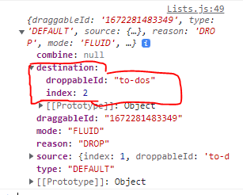
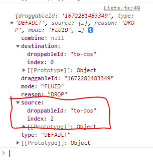

# 따라하며 배우는 리액트 A-Z

<br />
<br />
<br />

## 1. 리액트란
### 1-1. 리액트는 프레임워크가 아닌 라이브러리
> Angular 와 Vue는 프레임워크 vs 리액트 라이브러리
- 프레임워크 : 어떠한 앱을 만들기 위해 필요한 대부분의 것(라이브러리)을 가지고 있는 것.
- 라이브러리 : 어떠한 특정 기능을 모듈화 해놓은 것.

<br />
<br />

> 리액트는 전적으로 UI를 렌더링하는 관여한다
- 화면을 바꾸는 라우팅은 `react-router-dom` 모듈을 사용
- 상태 관리를 위해 `redux, mobx, recoil` 등 여러 모듈을 사용
- 빌드를 위해서는 `webpack, npm` 등
- 테스팅을 위해 `Eslint, Mocha, Jest` 등을 이용

#### 때문에 리액트는 프레임워크가 아닌 라이브러리

<br />
<br />
<br />

### 1-2. 리액트 컴포넌트
> 컴포넌트(Component)
- 리액트로 만들어진 앱을 이루는 최소한의 단위

<br />
<br />

> 리액트 컴포넌트는 두가지 타입이 있다.
- 클래스형 컴포넌트 (Class Components)
  ```javascript
  class App extends Component {
    render() {
      return <h1>안녕하세요</h1>
    }
  }
  ```

- 함수형 컴포넌트 (Functional Components)
  ```javascript
  function App() {
    return <h1>안녕하세요</h1>
  }
  ```

<br />
<br />
<br />

### 1-3. 브라우저가 그려지는 원리와 가상돔
리액트의 주요 특징 중 하나는 가상돔을 사용한다는 것.

> 웹페이지 빌드 과정 (Critical Rendering Path CRP)

<br />

- 웹 브라우저가 HTML 문서를 읽고 스타일 입히고 뷰포트에 표시하는 과정
- 여기서 문제점은 어떤 인터렉션에 의해 DOM에 변화가 발생하면,<br />그 때마다 Render Tree가 재생성. 즉 모든 요소들의 스타일을 다시 계산<br />Layout, Repaint 과정까지 다시 거치게 된다.<br />
- 많은 변화가 발생하면 성능상 문제 발생 우려
- 불필요한 DOM 조작 비용이 너무 크다는 단점 발생

<br />
<br />

> 가상 돔 Virtual DOM
- 위와 같은 문제점으로 인해 나오게 된 가상 돔 Virtual DOM
- **가상 돔이란, 실제 DOM을 메모리에 복사해준 것**으로 생각하면 된다.
- 데이터가 바뀌면 가상 돔에 렌더링되고 이전에 생긴 가상돔과 비교해서 바뀐 부분만 실제 돔에 적용을 시킨다.
- 바뀐 부분을 찾는 곽정을 `Diffing` 이라고 부르고<br />바뀐 부분만 실제 돔에 적용시켜주는 것을 `재조정(reconciliation)`.<br />
  
  
<br />
<br />
<br />

#### 1-4. 리액트 설치를 위해 필요한 것들
리액트 프로젝트를 만들기 위해서 `node.js`와 `npm`을 먼저 설치해야 한다.<br />
`node.js`를 받을 때 `npm`도 같이 설치 된다.

> Node.js
- 크롬 V8 자바스크립트 엔진으로 빌드한 자바스크립트 런타임으로서, **웹브라우저 환경이 아닌 곳**에서도 자바스크립트를 사용하여 연산할 수 있다.
- 리액트 웹은 웹 브라우저에서 실행되는 코드로 `node.js`와 직접적인 연관은 없지만<br />프로젝트를 개발하는데 주요 도구들이 `node.js`를 사용하기 때문에 필요하다.<br />이 때 사용하는 개발 도구는 바벨, 모듈화된 코드를 한 파일로 합치고 코드를 수정할 때마다 웹 브라우저를 리로딩하는 등 여러 기능을 지닌 웹팩 등이 있다.
- [(공홈)node.js 다운로드](https://nodejs.org/ko/)
  ```javascript
  // 설치된 node 버전을 알 수 있다.
  node -v
  ```

> Visual Studio Code
- [(공홈) Visual Studio Code 다운로드](https://code.visualstudio.com/download)

<br />
<br />
<br />

### 1-5. Create React App 을 이용해서 리액트 설치하기
> 리액트 앱 설치 방법
- `npx create-react-app 폴더이름` 명령어를 실행하여 설치.
- vscode에서 현재 폴더 기준으로 리액트를 설치하고자 할 땐,<br />`npx create-react-app ./` 명령어를 실행.
- `package.json` 기준, 재설치 등을 해야할 때 `npm install`

<br />
<br />

> `npx`는 무엇인가?
- npx는 노드 패키지 실행을 도와주는 도구.
- `create-react-app` 이란 `npm` 레지스트리에 있는 패키지를 **내가 지정(생성)한 폴더**에서 실행해서 리액트를 설치.

<br />
<br />
<br />

## 2. 간단한 To-Do 앱 만들며 리액트 익히기
- [간단한 To-Do 앱 만들며 리액트 익히기-1.pdf](https://github.com/eunhye8767/study-react/blob/master/inflearn/johnAhn/react__A-Z/%EC%88%98%EC%97%85%EC%9E%90%EB%A3%8C/%EA%B0%95%EC%9D%98%EB%8F%84%ED%91%9C%EC%9E%90%EB%A3%8C-PDF/%232%20%E1%84%80%E1%85%A1%E1%86%AB%E1%84%83%E1%85%A1%E1%86%AB%E1%84%92%E1%85%A1%E1%86%AB%20To-Do%20%E1%84%8B%E1%85%A2%E1%86%B8%20%E1%84%86%E1%85%A1%E1%86%AB%E1%84%83%E1%85%B3%E1%86%AF%E1%84%86%E1%85%A7%20%E1%84%85%E1%85%B5%E1%84%8B%E1%85%A2%E1%86%A8%E1%84%90%E1%85%B3%20%E1%84%8B%E1%85%B5%E1%86%A8%E1%84%92%E1%85%B5%E1%84%80%E1%85%B5-1.pdf)
- [간단한 To-Do 앱 만들며 리액트 익히기-2.pdf](https://github.com/eunhye8767/study-react/blob/master/inflearn/johnAhn/react__A-Z/%EC%88%98%EC%97%85%EC%9E%90%EB%A3%8C/%EA%B0%95%EC%9D%98%EB%8F%84%ED%91%9C%EC%9E%90%EB%A3%8C-PDF/%232%20%E1%84%80%E1%85%A1%E1%86%AB%E1%84%83%E1%85%A1%E1%86%AB%E1%84%92%E1%85%A1%E1%86%AB%20To-Do%20%E1%84%8B%E1%85%A2%E1%86%B8%20%E1%84%86%E1%85%A1%E1%86%AB%E1%84%83%E1%85%B3%E1%86%AF%E1%84%86%E1%85%A7%20%E1%84%85%E1%85%B5%E1%84%8B%E1%85%A2%E1%86%A8%E1%84%90%E1%85%B3%20%E1%84%8B%E1%85%B5%E1%86%A8%E1%84%92%E1%85%B5%E1%84%80%E1%85%B5-2.pdf)
- [간단한 To-Do 앱 만들며 리액트 익히기-3.pdf](https://github.com/eunhye8767/study-react/blob/master/inflearn/johnAhn/react__A-Z/%EC%88%98%EC%97%85%EC%9E%90%EB%A3%8C/%EA%B0%95%EC%9D%98%EB%8F%84%ED%91%9C%EC%9E%90%EB%A3%8C-PDF/%232%20%E1%84%80%E1%85%A1%E1%86%AB%E1%84%83%E1%85%A1%E1%86%AB%E1%84%92%E1%85%A1%E1%86%AB%20To-Do%20%E1%84%8B%E1%85%A2%E1%86%B8%20%E1%84%86%E1%85%A1%E1%86%AB%E1%84%83%E1%85%B3%E1%86%AF%E1%84%86%E1%85%A7%20%E1%84%85%E1%85%B5%E1%84%8B%E1%85%A2%E1%86%A8%E1%84%90%E1%85%B3%20%E1%84%8B%E1%85%B5%E1%86%A8%E1%84%92%E1%85%B5%E1%84%80%E1%85%B5-3.pdf)

<br />
<br />
<br />

## 3. To-Do 앱 최적화 하기
- [To-Do 앱 최적화 하기-1.pdf](https://github.com/eunhye8767/study-react/blob/master/inflearn/johnAhn/react__A-Z/%EC%88%98%EC%97%85%EC%9E%90%EB%A3%8C/%EA%B0%95%EC%9D%98%EB%8F%84%ED%91%9C%EC%9E%90%EB%A3%8C-PDF/%233%20To-Do%20%E1%84%8B%E1%85%A2%E1%86%B8%20%E1%84%8E%E1%85%AC%E1%84%8C%E1%85%A5%E1%86%A8%E1%84%92%E1%85%AA%20%E1%84%92%E1%85%A1%E1%84%80%E1%85%B5-1.pdf)
- [To-Do 앱 최적화 하기-2.pdf](https://github.com/eunhye8767/study-react/blob/master/inflearn/johnAhn/react__A-Z/%EC%88%98%EC%97%85%EC%9E%90%EB%A3%8C/%EA%B0%95%EC%9D%98%EB%8F%84%ED%91%9C%EC%9E%90%EB%A3%8C-PDF/%233%20To-Do%20%E1%84%8B%E1%85%A2%E1%86%B8%20%E1%84%8E%E1%85%AC%E1%84%8C%E1%85%A5%E1%86%A8%E1%84%92%E1%85%AA%20%E1%84%92%E1%85%A1%E1%84%80%E1%85%B5-2.pdf)

<br />

#### 3-1. [참조] 리액트 모듈 설치 시 나는 종속성(dependency) 에러 해결 방법
리액트18 버전에서 라이브러리들을 설치할 때<br />
종속성에 관한 에러가 날 때가 많이 있습니다. 


```javascript
npm ERR! code ERESOLVE
npm ERR! ERESOLVE unable to resolve dependency tree
npm ERR! Found: react@18.1.0
npm ERR! node_modules/react
npm ERR!  react@"^18.1.0" from the root project
npm ERR! Could not resolve dependency:
npm ERR! peer react@"^17.0.1" from react-dnd...
```

#### 원인
`unable to resolve dependency tree`<br />
리액트 18 버전 라이브러리와 설치하려는 해당 라이브러리의 종속성이 안 맞기 때문입니다.

#### 해결 방법
이럴 때는 여러 가지 해결방법이 있는데 <br />
첫 번째는 리액트 버전을 17로 낮추는 것인데 별로 좋은 방법은 아닙니다. <br />
<br />

다른 방법은 npm 대신에 **yarn을 이용해서 yarn install로 종속성을 설치**해주는 방법입니다. <br />
만약 yarn으로 설치해도 안된다면 <br />
npm의 강제 설치 옵션으로 설치해주시면 됩니다.

```javascript
//  기존 버전 다 무시하고 일단 설치.
--legacy-peer-deps 

// package-lock.json에 몇가지의 다른 의존 버전들을 추가하면서 설치.
--force
```

<br />
<br />

#### 3-2. tailwind CSS 사용
- vscode 경우, `tailwind CSS IntelliSense`를 설치한다.
- [Tailwind CSS 공홈 바로가기](https://tailwindcss.com/)
- [CRA에 TailWindCSS 적용하기](https://tailwindcss.com/docs/guides/create-react-app)
  - Install Tailwind CSS
    ```javascript
    // tailwind 모듈 설치
    npm install -D tailwindcss postcss autoprefixer

    // tailwind.config.js 파일 생성
    npx tailwindcss init -p
    ```

  - tailwind.config.js
    ```javascript
    // 아래와 같이 적용

    /** @type {import('tailwindcss').Config} */
    module.exports = {
      content: [
        "./src/**/*.{js,jsx,ts,tsx}",
      ],
      theme: {
        extend: {},
      },
      plugins: [],
    }
    ```

  - `index.css` : 메인 css파일에 추가
    ```css
    /* 아래 문구 추가 */
    @tailwind base;
    @tailwind components;
    @tailwind utilities;
    ```

  - 제대로 설치 및 적용이 완료되었는 지 확인하기<br />(**설치 후 재실행 필수**)
    ```html
    <h1 className="text-3xl font-bold underline">할 일 목록</h1>
    ```

<br />
<br />

#### 3-4. HTML 드래그 앤 드롭 
- [MDN, Drag and Drop API 자세히 보기](https://developer.mozilla.org/ko/docs/Web/API/HTML_Drag_and_Drop_API)
- HTML 드래그 앤 드롭 API를 사용하여 원하는 목록을 드래그 가능하게 만든다.
<br />

> react-beautiful-dnd 라이브러리
- 사용자가 드래그를 할 때 적절한 애니메이션을 준다.<br />사용자가 드래그를 멈췄는 지 확인하고 여기에서도 애니메이션을 준다.<br />클라이언트가 목록을 재정렬한 경우 항목의 위치를 새 항목으로 업데이트 한다.<br /><br />**이것을 쉽게 구현할 수 있게 도와주는 모듈.**

- 모듈 설치 : `npm install react-beautiful-dnd --save`
- [npm js - react-beautiful-dnd 자세히보기](https://www.npmjs.com/package/react-beautiful-dnd)<br />
  <br />

<br />
<br />

> (1) API를 이용한 틀 만들어주기
```javascript
// Lists.js
import { DragDropContext, Droppable, Draggable } from 'react-beautiful-dnd';

<div>
  <DragDropContext>
    <Droppable>
      {todoData.map(data => (
        <Draggable>
          <div key={data.id}>
            <div className="flex items-center justify-between w-full px-4 py-1 my-2 text-gray-600 bg-gray-100 border rounded">
              <div className="items-center">
                <input 
                  type="checkbox" 
                  id={`ck-${data.id}`}
                  onChange={ () => { handleCompleChange(data.id) } }
                  defaultChecked={false}
                />

                <label htmlFor={`ck-${data.id}`} className={`pl-2 ${data.completed && 'line-through'}`}>{data.title}</label>
              </div>
              <div className="items-center">
                <button onClick={ () => handleClick(data.id) }>x</button>
              </div>
            </div>
          </div>
        </Draggable>
      ))}
    </Droppable>
  </DragDropContext>
</div>
```
- `DragDropContext` : 드래그(drag) & 드랍(drop)을 원하는 부분을 감싸준다.
- `Droppable` : 드랍(drop)할 수 있는 부분을 감싸준다.
- `Draggable` : 드래그(drag)할 수 있는 부분을 감싸준다.

<br />
<br />

> (2) provided object를 적용
```javascript
// Lists.js
import { DragDropContext, Droppable, Draggable } from 'react-beautiful-dnd';

<div>
  <DragDropContext>
    <Droppable droppableId="to-dos">
      {(provided) => (
        // provided 정보와 ref를 적용한다.
        <div {...provided.droppableProps} ref={provided.innerRef}>
          {todoData.map((data, index) => (
            /**
             *  map 이기 때문에 Draggable 태그에 key 값을 적용한다.
             *  draggableId와 index 값을 적용한다.
             */
            <Draggable
              key={data.id}
              draggableId={data.id.toString()}
              index={index}
            >
              {(provided, snapshot) => (
                /**
                 *  map 이기 때문에 key 값을 적용한다.
                 *  provided의 props를 적용한다 (정보가 있어야 드래그 앤 드롭이 가능하다.)
                 *    ㄴ draggableProps, dragHandleProps
                 * 
                 *  snapshot.isDragging을 기준으로 
                 *  드래그 할 때, 하지 않았을 때 클래스 값을 적용한다.
                 */
                <div 
                  key={data.id}
                  {...provided.draggableProps}
                  ref={provided.innerRef}
                  {...provided.dragHandleProps}
                  className={
                    snapshot.isDragging ? "selected" : "not-selected"
                  }>
                  <div className="flex items-center justify-between w-full px-4 py-1 my-2 text-gray-600 bg-gray-100 border rounded">
                    <div className="items-center">
                      <input 
                        type="checkbox" 
                        id={`ck-${data.id}`}
                        onChange={ () => { handleCompleChange(data.id) } }
                        defaultChecked={false}
                      />

                      <label htmlFor={`ck-${data.id}`} className={`pl-2 ${data.completed && 'line-through'}`}>{data.title}</label>
                    </div>
                    <div className="items-center">
                      <button onClick={ () => handleClick(data.id) }>x</button>
                    </div>
                  </div>
                </div>
              )}
            </Draggable>
          ))}
          {provided.placeholder}
        </div>
      )}
    </Droppable>
  </DragDropContext>
</div>
```
- `<Droppable droppableId="to-dos">` : `droppableId`로 아이디 값을 적용한다.
- `provided object` : 스타일 지정 및 조회를 위한 속성이 포함되어 있다.
- 사용자가 요소를 드래그한 경우, `className` 속성을 `selected`로 변경한다. 나중에 스타일을 적용하는데 사용할 것이다.
- `placeholder` 속성은 목록에 빈 공간을 만든다.<br />이렇게 하면 드래그 작업이 자연스럽게 느껴진다.<br />(적용했을 때, 적용하지 않았을 때 차이를 확인할 것!)
- 현재까지 작업했을 때, 드래그 & 드랍 기능은 작동하나 데이터가 변경되진 않는다.

<br />
<br />

> react 18 버전에서 나는 에러 해결 방법
리액트 18버전을 사용할 때 드래그 앤 드랍 기능을 사용하면 이러한 에러가 나옵니다.<br />
<br />
<br />

그럴 때는 리액트의 StricMode를 제거해주시면 됩니다.<br />
<br />
<br />

```javascript
// index.js
const root = ReactDOM.createRoot(document.getElementById('root'));
root.render(
  // <React.StrictMode>
    <App />
  // </React.StrictMode>
);
```

<br />
<br />

> Dragging 하는 요소의 스타일링 변경
- 수정전
```javascript
<div 
  key={data.id}
  {...provided.draggableProps}
  ref={provided.innerRef}
  {...provided.dragHandleProps}
  className={ snapshot.isDragging ? "selected" : "not-selected" }
  >
  <div className="flex items-center justify-between w-full px-4 py-1 my-2 text-gray-600 bg-gray-100 border rounded">
```
<br />

- 수정후 : 드래그 할 때 배경색 변경.
- 의미없는 `div` 태그가 `<div><div></div></div>` 중복되어 있어서 하나로 합쳤다.
```javascript
<div 
  key={data.id}
  {...provided.draggableProps}
  ref={provided.innerRef}
  {...provided.dragHandleProps}
  className={`
    ${snapshot.isDragging ? "bg-gray-400" : "bg-gray-100"}
    flex items-center justify-between w-full px-4 py-1 my-2 text-gray-600 border rounded
  `}>
```

<br />
<br />

> splice 메서드 알아보기
- [MDN, splice 메서드 자세히 보기](https://developer.mozilla.org/ko/docs/Web/JavaScript/Reference/Global_Objects/Array/splice)
- `splice() 메서드` : 배열의 기존 요소를 삭제 또는 교체하거나 새 요소를 추가하여 배열의 내용을 변경.
- (예제) 3번 인덱스에서 한 개 요소 제거
  ```javascript
  var myFish = ['angel', 'clown', 'drum', 'mandarin', 'sturgeon'];
  var removed = myFish.splice(3, 1);

  // removed is ["mandarin"]
  // myFish is ["angel", "clown", "drum", "sturgeon"]
  ```

- (예제) 2번 인덱스에서 한 개 요소 제거하고 "trumpet" 추가
  ```javascript
  var myFish = ['angel', 'clown', 'drum', 'sturgeon'];
  var removed = myFish.splice(2, 1, 'trumpet');

  // myFish is ["angel", "clown", "trumpet", "sturgeon"]
  // removed is ["drum"]
  ```

- (예제) 하나도 제거하지 않고, 2번 인덱스에 "drum" 추가
  ```javascript
  var myFish = ['angel', 'clown', 'mandarin', 'sturgeon'];
  var removed = myFish.splice(2, 0, 'drum');

  // myFish is ["angel", "clown", "drum", "mandarin", "sturgeon"]
  // removed is [], no elements removed
  ```

<br />
<br />

> Dragging 한 후 데이터 순서 적용(persistence)
- `<DragDropContext onDragEnd={handleEnd}>` : `DragDropContext`에 드래그가 끝나는 이벤트 적용.
- `handleEnd` 이벤트 생성.<br />`console.log(result)`를 콘솔 로그로 출력하면 관련 정보를 확인할 수 있다.
  - `destination` : 어디로 이동 했는 지에 대한 정보 확인.<br />
    <br />
    <br />

  - `source` : 기존 어디에 있었는 지에 대한 정보 확인.<br />
    <br />
    <br />
  
  ```javascript
  const handleEnd = (result) => {
    /**
     *  result 매개변수에는 source 항목 및 대상 위치와 같은 
     *  드래그 이벤트에 대한 정보가 포함된다.
     */
    console.log(result)

    // 목적지가 없으면(이벤트 취소) 이 함수를 종료한다.
    if (!result.destination) return;

    // 리액트 불변성을 지켜주기 위해 새로운 todoData 생성
    const newTodoData = todoData;

    /**
     *  1. 변경시키는 아이템을 배열에서 지워준다
     *  2. return 값으로 지워진 아이템을 잡아준다.
     */
    const [reorderedItem] = newTodoData.splice(result.source.index, 1);

    // 원하는 자리에 reorderedItem을 insert 해준다.
    newTodoData.splice(result.destination.index, 0, reorderedItem);
    setTodoData(newTodoData);
  }
  ```