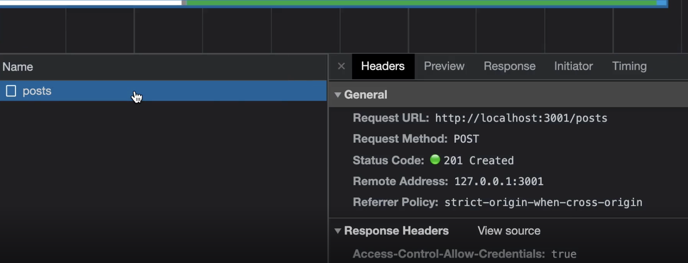
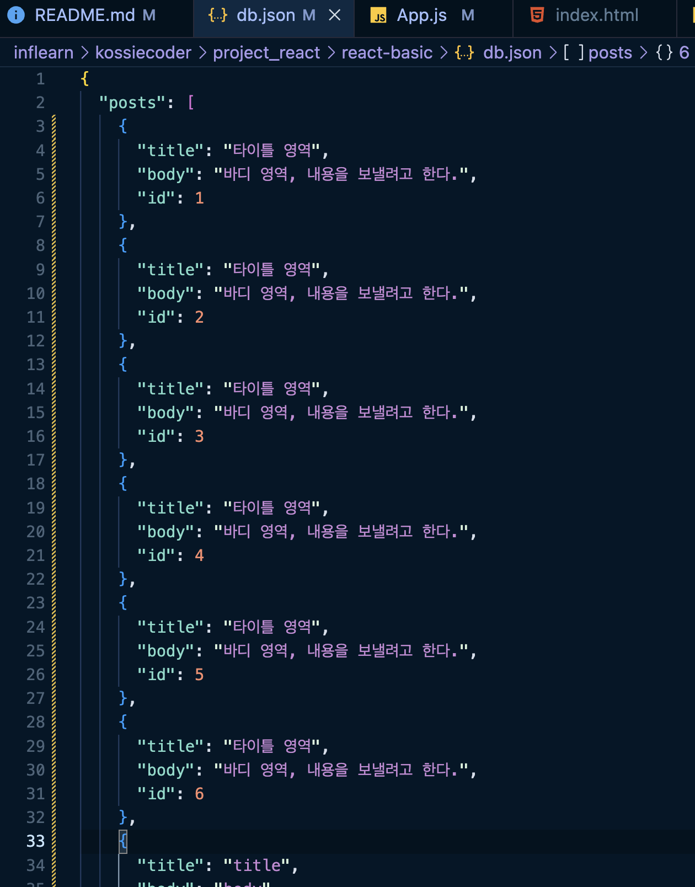

# 프로젝트로 배우는 React.js

#### 1. useState(prevState)
```javascript
import { useState } from 'react';

const [number, setNumber] = useState(1);

const handleChange = () => {
  setNumber(prevState => prevState * 2);
  console.log(number)
}
```

- `prevState` <br >
=> 작명 가능하나 통상적으로 prevState 칭함.<br />
=> 이전 state 값을 가져와서 변경할 수 있음.
- `console.log(number)` <br />
=> 바뀐 useState 값이 나오는 것이 아닌 이전 `number` 값이 나온다.<br />
=> 리-렌더링 후 바뀌기 때문에 바뀌기 전 `number` 값이 나오는 것이다.

<br />
<br />
<br />

#### 2. json-server
- 리액트에서 사용하는 (가짜)데이터 베이스 패키지
- [npm, json-server](https://www.npmjs.com/package/json-server)
  - `json-server command not found` 에러 발생 시 전역으로 설치
  ```
  // 글로벌용(전역)
  npm install -g json-server

  // 해당 프로젝트에만 설치 (-g 빼고 설치)
  npm i json-server
  ```

- 루트폴더에 `db.json` 파일 생성.
  ```javascript
  // 예시
  {
    "posts": [
      { "id": 1, "title": "json-server", "author": "typicode" }
    ],
    "comments": [
      { "id": 1, "body": "some comment", "postId": 1 }
    ],
    "profile": { "name": "typicode" }
  }
  ```

- 새로 만든 `db.json`을 `json-server`로 실행.
  ```
  json-server --watch db.json

  // 포트 번호 적용할 때
  json-server --watch db.json --port 3001
  ```

- 터미널에서 아래 URL 주소 확인 가능. => /posts 부분이 db.json 파일.
  ```
  Resources
  http://localhost:3000/posts

  Home
  http://localhost:3000
  ```
<br />
<br />
<br />

#### 3. DB에 데이터 저장
- DB에 데이터 저장하기에 앞서 `axios`를 설치.
  - [npm, axios](https://www.npmjs.com/package/axios)
  ```
  npm i axios
  ```
- `json-server`
  ```
  Plural routes
  GET    /posts        
  GET    /posts/1   
  POST   /posts  
  PUT    /posts/1      (아이디가 1인 posts를 전체 업데이트 시)
  PATCH  /posts/1      (아이디가 1인 posts를 부분 업데이트 시)
  DELETE /posts/1
  ```

- `axios post` 적용
  ```javascript
  import axios from "axios";

  const onSubmit = () => {
    axios.post("http://localhost:3000/posts", {
      title,
      body
    })
  }
  ```

- `axios post`를 통해 보내게 되면 브라우저, 네트워크 탭에서 보낸 것을 확인할 수 있다. (터미널에서도 확인 가능)<br />
  

- `db.json` 파일에 보낸 데이터가 등록된 것을 확인 할 수 있다.<br />
  

<br />
<br />
<br />

#### 4. db 실행 명령어 스크립트에 넣기
- `package.json` 파일에 db를 실행시켜주는 명령어 코드를 추가 한다.
  ```javascript
  // package.json
  "scripts": {
    "start": "react-scripts start",
    "db": "json-server --watch db.json --port 3001",
  ```
- `db`를 실행시키고자 할 땐, `npm run db`

<br />
<br />
<br />

#### 5. React Router
- [react router (공홈)](https://reactrouter.com/en/main)
- 라우터(React Router) 설치
  ```
  npm install react-router-dom
  ```
- 라우터 기본 구조
  ```javascript
  import {
    BrowserRouter as Router, // BrowserRouter => Router로 사용
    Switch,
    Route,
    Link
  } from "react-router-dom"

  function App() {
    return (
      <Router>
        <div>
          <Link to="/">Home</Link>
          <Link to="/blogs">Blogs</Link>
        </div>
        
        <Switch>
          <Route path="/" exact>Home page</Route>
          <Route path="/blogs">Blogs page</Route>
        </Switch>
      </Router>
    )
  }
  ```
  - `<Route path="/" exact>` : `path="/"` 처럼 주소(경로)가 "/"일 때만 해당 컴포넌트 출력.
  - `<Route path="/">` :  `path="/"`처럼 주소(경로)에 들어갈 때 해당 컴포넌트 출력.

  <br />
  <br />
  <br />

#### 6. NavLink
- `NavLink`를 이용하여 `active` 효과를 줄 수 있다.
- [react router - navlink 공홈](https://reactrouter.com/en/main/components/nav-link)
  ```javascript
  import * as React from "react";
  import { NavLink } from "react-router-dom";

  function NavList() {
    let activeStyle = {
      textDecoration: "underline",
    };

    let activeClassName = "underline";

    return (
      <nav>
        <ul>
          <li>
            <NavLink
              to="messages"
              style={({ isActive }) =>
                isActive ? activeStyle : undefined
              }
            >
              Messages
            </NavLink>
          </li>
          <li>
            <NavLink
              to="tasks"
              className={({ isActive }) =>
                isActive ? activeClassName : undefined
              }
            >
              Tasks
            </NavLink>
          </li>
  ```

- [v5 router](https://v5.reactrouter.com/web/api/NavLink/exact-bool)
  - **exact: bool** : 정확한 주소일 때. ex) /profile/edit 일 때 activeClass 적용 불가.
    ```html
    <NavLink exact to="/profile">
      Profile
    </NavLink>
    ```

  - **strict: bool** : 엄격한
    ```html
    <NavLink strict to="/events/">
      Events
    </NavLink>
    ```

  - exact, strice 모드 외에 다른 모드도 있다. <br />상황에 따라 맞는 모드를 적용하면 될 듯 하다. (가이드 참고, 버전에 따라 다를 수 있음.)